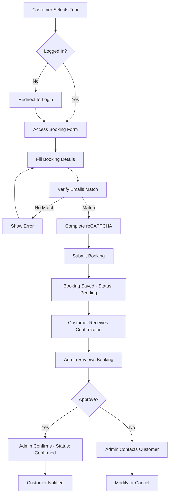

## Overview

The Bookings feature enables customers to reserve safari tours and allows administrators to manage all booking requests. The system captures essential customer information, travel details, and special requirements while maintaining booking status throughout the reservation lifecycle.

## Key Features

<CardGroup cols={2}>
  <Card title="Customer Profiles" icon="user">
    Authenticated users can view and manage their booking history
  </Card>
  <Card title="Transaction Tracking" icon="receipt">
    Unique transaction codes for each booking ensure proper tracking
  </Card>
  <Card title="Email Verification" icon="envelope-circle-check">
    Double email entry prevents booking errors and ensures communication
  </Card>
  <Card title="Status Management" icon="circle-check">
    Administrators can confirm or modify booking status
  </Card>
</CardGroup>

## Booking Information

### Database Fields

Each booking contains the following information:

| Field | Type | Description |
|-------|------|-------------|
| `transaction_code` | string | Unique identifier for the booking |
| `first_name` | string | Customer's first name |
| `last_name` | string | Customer's last name |
| `email` | string | Customer's email address |
| `phone_number` | string | Contact phone number |
| `country` | string | Customer's country of residence |
| `arrival_date` | date | Planned arrival date for the safari |
| `adults` | string | Number of adult travelers |
| `kids` | string | Number of children |
| `destination` | string | Selected tour/safari destination |
| `special_requirements` | text | Any special needs or requests |
| `user_id` | integer | ID of the user who made the booking |
| `status` | string | Booking status (0 = pending, 1 = confirmed) |

## Making a Booking (Customer Flow)

<Steps>
  <Step title="Authentication Required">
    Customers must be logged in with a verified email address to make a booking
    
    <Warning>
    Attempting to book without authentication will redirect to the booking page with a message prompting login
    </Warning>
  </Step>
  
  <Step title="Access Booking Form">
    Navigate to `/bookings/create/{destination}` where `{destination}` is the desired safari tour
    
    The booking page displays:
    - Latest 3 tours for reference
    - All available tour categories
    - Related blog content
    - The selected destination
  </Step>
  
  <Step title="Complete Booking Form">
    Fill in all required information:
    
    **Personal Information**
    - First name
    - Last name
    - Phone number
    - Country of residence
    
    **Email Verification**
    - Email address (first entry)
    - Email confirmation (second entry)
    
    <Info>Both email fields must match exactly to proceed with the booking</Info>
    
    **Travel Details**
    - Arrival date
    - Number of adults
    - Number of children
    - Destination (pre-filled)
    
    **Transaction Information**
    - Transaction code (payment reference)
    
    **Additional Information**
    - Special requirements (optional but recommended)
    
    **Security**
    - Complete the reCAPTCHA verification
  </Step>
  
  <Step title="Submit Booking">
    Click "Submit" to create the booking. Upon success:
    - The booking is saved with a pending status
    - You're redirected to your profile page
    - A success message confirms: "Booking has been successful, We will contact you within 24hrs!"
  </Step>
</Steps>

## Viewing Bookings

### Customer Profile

Authenticated customers can view their booking history at `/profile` (route name: `profile`). This page displays:
- All bookings associated with the logged-in user
- Most recent bookings first
- 10 bookings per page with pagination
- Current booking status for each reservation

### Administrator View

Administrators can access all bookings in the system at `/bookings` (route name: `bookings`). This view shows:
- All bookings from all customers
- Latest bookings first
- 10 bookings per page with pagination
- Quick actions for managing each booking

<Note>
Administrator access requires both authentication and email verification
</Note>

## Managing Bookings (Administrator)

### Viewing Booking Details

To view complete details of a specific booking, navigate to `/bookings/show/{id}` where `{id}` is the booking ID.

### Editing a Booking

<Steps>
  <Step title="Access Edit Page">
    Navigate to `/bookings/edit/{id}` to modify booking details
  </Step>
  
  <Step title="Update Information">
    Modify any of the following fields:
    - First name (required)
    - Last name (required)
    - Email address (required)
    - Phone number (required)
    - Arrival date (required)
    - Number of adults (required)
    - Number of children (required)
  </Step>
  
  <Step title="Save Changes">
    Click "Update" to save the modifications. You'll be redirected to the bookings list with a success message
  </Step>
</Steps>

### Confirming/Updating Booking Status

Administrators can toggle booking status between pending and confirmed:

<Tabs>
  <Tab title="Confirming a Booking">
    To confirm a pending booking:
    1. Navigate to the bookings list (`/bookings`)
    2. Find the booking with status 0 (pending)
    3. Click "Confirm" (DELETE request to `/bookings/publish/{id}`)
    4. Status updates to 1 (confirmed)
    5. Customer can be notified of confirmation
  </Tab>
  
  <Tab title="Reverting to Pending">
    To change a confirmed booking back to pending:
    1. Navigate to the bookings list
    2. Find the booking with status 1 (confirmed)
    3. Click "Unconfirm"
    4. Status updates to 0 (pending)
  </Tab>
</Tabs>

### Deleting a Booking

<Warning>
Deleting a booking permanently removes it from the system. This action cannot be undone.
</Warning>

To delete a booking:
1. Navigate to the bookings list
2. Click "Delete" on the booking you want to remove
3. Confirm the deletion
4. The booking will be permanently removed

## Validation Rules

The system enforces the following validation when creating bookings:

```php
'first_name' => 'required',
'last_name' => 'required',
'phone_number' => 'required',
'arrival_date' => 'required',
'adults' => 'required',
'kids' => 'required',
'destination' => 'required',
'g-recaptcha-response' => 'required|captcha',  // reCAPTCHA verification
'transaction_code' => 'required'
```

### Email Validation

The system includes special email validation logic:
- Two separate email fields must be filled (`email1` and `email2`)
- Both entries must match exactly
- If emails don't match, the booking is rejected with the error: "please provide matching emails"
- The matched email is then stored in the booking record

## Routes Reference

| Action | Method | Route | Route Name | Auth Required |
|--------|--------|-------|------------|---------------|
| List bookings (admin) | GET | `/bookings` | `bookings` | Yes (verified) |
| Show booking details | GET | `/bookings/show/{id}` | `bookings.show` | Yes (verified) |
| Create booking form | GET | `/bookings/create/{destination}` | `bookings.create` | No* |
| Store new booking | POST | `/bookings/new` | `bookings.store` | Yes (verified) |
| Edit booking form | GET | `/bookings/edit/{id}` | `bookings.edit` | Yes (verified) |
| Update booking | POST | `/bookings/update/{id}` | `bookings.update` | Yes (verified) |
| Delete booking | DELETE | `/bookings/delete/{id}` | `bookings.delete` | Yes (verified) |
| Toggle confirm status | DELETE | `/bookings/publish/{id}` | `bookings.confirm` | Yes (verified) |
| View customer profile | GET | `/profile` | `profile` | Yes (verified) |

<Note>
*While authentication is not enforced on the booking form route, attempting to submit without authentication will fail. The form is accessible to show the login requirement message.
</Note>

## Booking Workflow



## Security Features

<CardGroup cols={2}>
  <Card title="Authentication" icon="lock">
    Only authenticated users with verified emails can create bookings
  </Card>
  <Card title="reCAPTCHA" icon="shield-check">
    Prevents automated booking spam and bot submissions
  </Card>
  <Card title="Email Verification" icon="envelopes-bulk">
    Double-entry email confirmation prevents typos and ensures accuracy
  </Card>
  <Card title="User Association" icon="user-lock">
    Each booking is tied to a specific user account for accountability
  </Card>
</CardGroup>

## Best Practices

<AccordionGroup>
  <Accordion title="For Customers">
    **Before Booking**
    - Create and verify your account before starting the booking process
    - Have your transaction/payment code ready
    - Double-check your arrival date
    - Review the tour details carefully
    
    **During Booking**
    - Enter your email address carefully in both fields
    - Provide accurate contact information
    - Include detailed special requirements (dietary needs, accessibility, etc.)
    - Save your transaction code for reference
    
    **After Booking**
    - Check your email for booking confirmation
    - Note that you'll be contacted within 24 hours
    - Review your booking in your profile
    - Contact support if you need to make changes
  </Accordion>
  
  <Accordion title="For Administrators">
    **Processing Bookings**
    - Review new bookings daily
    - Contact customers within the promised 24-hour timeframe
    - Verify transaction codes before confirming
    - Check special requirements and ensure they can be accommodated
    
    **Managing Bookings**
    - Keep booking statuses updated
    - Document any changes or communications
    - Only delete bookings when absolutely necessary
    - Use edit function rather than delete when possible
    
    **Customer Service**
    - Respond promptly to booking inquiries
    - Clarify any unclear special requirements
    - Confirm all details before the arrival date
    - Maintain professional communication
  </Accordion>
</AccordionGroup>

## Troubleshooting

<AccordionGroup>
  <Accordion title="Booking Form Won't Submit">
    **Problem**: Form submission fails or shows errors
    
    **Solutions**:
    - Verify you're logged in with a verified email address
    - Ensure both email fields contain matching addresses
    - Complete the reCAPTCHA verification
    - Check that all required fields are filled
    - Verify the transaction code is entered
    - Try clearing your browser cache and cookies
  </Accordion>
  
  <Accordion title="Email Mismatch Error">
    **Problem**: Getting "please provide matching emails" error
    
    **Solutions**:
    - Carefully re-enter both email addresses
    - Check for extra spaces or typos
    - Copy and paste the same email in both fields
    - Ensure no special characters are causing issues
  </Accordion>
  
  <Accordion title="Cannot See My Bookings">
    **Problem**: Profile page doesn't show booking history
    
    **Solutions**:
    - Verify you're logged into the account used to make the booking
    - Check that the booking was successfully submitted
    - Look for a success confirmation message after booking
    - Contact administrator if bookings are missing
  </Accordion>
  
  <Accordion title="Status Not Updating (Admin)">
    **Problem**: Confirm/unconfirm action doesn't work
    
    **Solutions**:
    - Refresh the bookings page
    - Verify you have proper authentication
    - Check that the booking ID is valid
    - Clear application cache if using caching
  </Accordion>
</AccordionGroup>

## Related Features

<CardGroup cols={2}>
  <Card title="Tours & Safaris" icon="compass" href="/features/tours-safaris">
    Browse available tours before making a booking
  </Card>
  <Card title="User Management" icon="users">
    User accounts and authentication are required for bookings
  </Card>
  <Card title="Email Verification" icon="envelope-circle-check">
    Email verification is mandatory before booking
  </Card>
  <Card title="Categories" icon="folder">
    Tours are organized by categories for easy selection
  </Card>
</CardGroup>

## Integration Points

### Payment Processing

The booking system requires a `transaction_code` field, indicating integration with a payment system. Customers should:
1. Complete payment through your payment gateway
2. Receive a transaction code
3. Enter this code when making the booking

<Info>
The transaction code field is required but the actual payment processing logic is handled separately from the booking system.
</Info>

### Email Notifications

While the controller imports email functionality (`use App\Mail;`), you may want to set up automatic email notifications for:
- Booking confirmation to customers
- New booking alerts to administrators
- Status change notifications
- Booking reminders as arrival date approaches

### Customer Communication

The system promises to "contact you within 24hrs" after booking. Ensure you have processes in place for:
- Monitoring new bookings
- Verifying booking details
- Confirming availability
- Sending detailed itineraries
- Providing pre-arrival information